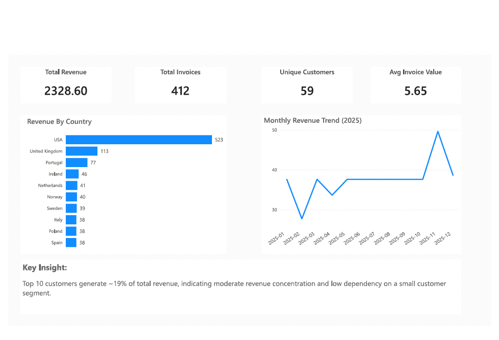

# Chinook Sales Analytics  
**SQL Portfolio Project (PostgreSQL + Power BI)**

## Overview
This project analyzes **sales performance and customer behavior** using the **Chinook** sample database in **PostgreSQL**.

The objective is to demonstrate **business-focused SQL analytics skills**, including:
- KPI definition aligned with business questions  
- Aggregations, joins, and filtering  
- CTE-based analysis and window-style logic  
- Translating transactional data into **actionable insights**

---

## Business Questions Addressed
- How has **monthly revenue** changed over time?
- Which customers contribute the most to total revenue?
- What percentage of revenue comes from **top customers**?
- Which countries generate the highest revenue?
- What is the **average invoice value**?
- How frequently do customers purchase (repeat vs low-frequency)?

---

## Tools & Technologies
- **PostgreSQL** (pgAdmin)
- **SQL** (CTEs, aggregations, grouping, filtering)
- **Power BI** (KPI cards, trends, country-level visuals)

---

## Dataset Notes
The Chinook database is a **sample dataset**.  
Some observed patterns (e.g., high repeat-customer behavior) reflect dataset design rather than real-world commercial dynamics.

> The focus of this project is **analytical structure, clarity, and business logic**, not domain realism.

## Data Model & Core Tables
- **Customer**: stores customer details and geographic information  
- **Invoice**: represents sales transactions at the invoice level  
- **InvoiceLine**: contains line-level purchase details  
- **Track**: individual products sold  
- **Album & Artist**: product hierarchy  
- **Genre**: music category classification  

### Key Relationships
- Customer → Invoice → InvoiceLine → Track → Album → Artist  
- Track → Genre
---

## KPIs & SQL Implementation
Each KPI is implemented as a **standalone, well-documented SQL script**:

- **KPI 1 – Overall Sales Performance**  
  `sql/01_overall_kpis.sql`

- **KPI 2 – Monthly Revenue Trend**  
  `sql/02_monthly_revenue_trend.sql`

- **KPI 3 – Top Customers by Revenue**  
  `sql/03_top_customers.sql`

- **KPI 4 – Revenue Concentration (Top 10 Share %)**  
  `sql/04_revenue_concentration_top10.sql`

- **KPI 5 – Revenue by Country**  
  `sql/05_revenue_by_country.sql`

- **KPI 6 – Customer Purchase Frequency Segmentation**  
  `sql/06_customer_frequency.sql`

---

## Dashboard Preview (Power BI)

The dashboard below presents an executive-style overview of sales KPIs,
monthly revenue trends, and geographic performance derived from SQL analysis.

---

## Key Insights
- Monthly aggregation makes revenue patterns more interpretable.
- The **top 10 customers contribute ~19%** of total revenue, indicating **moderate revenue concentration** and low dependency on a small customer segment.
- Country-level analysis highlights geographic revenue distribution.
- Purchase-frequency segmentation demonstrates **retention-style analytical logic**.

---

## How to Run
1. Load the Chinook PostgreSQL SQL script into a database (e.g., `chinook`) using pgAdmin.
2. Open any file under `/sql` and execute the queries independently.

---

## Possible Extensions
- Customer Lifetime Value (CLV)
- Cohort-based retention analysis
- Genre-level profitability analysis
